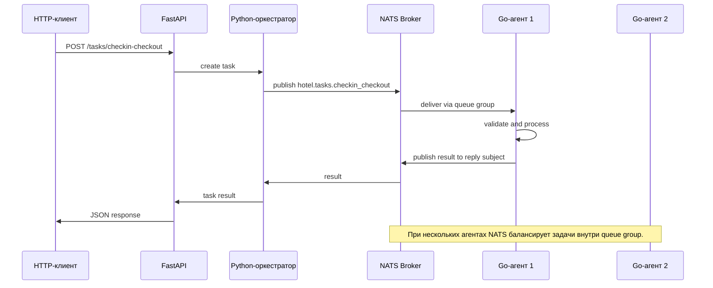

Орехов Артем, группа 221331, Лабораторная работа 13, Вариант 29, Сложность средняя
# Лабораторная работа 13

Тема: **система управления гостиницей**.

В системе используются агенты:

- `checkin_checkout` - заселение и выселение гостей.
- `housekeeping` - уборка комнат.
- `guest_requests` - обработка запросов гостей.
- `billing` - биллинг оплаты.
- `cancellations` - управление отменами.

## 1. Определение агентов и их ролей

| Агент | Роль | Входные данные | Выходные данные | Бизнес-правила |
|---|---|---|---|---|
| Заселение/выселение | Проверяет возможность заселения или выселения, меняет статус номера | `task_id`, `action`, `guest_id`, `room_id`, `reservation_id`, `paid`, `room_ready` | Статус операции, сообщение, новый статус номера | Заселение разрешено только при готовом номере и оплаченной брони. Выселение переводит номер в статус `needs_cleaning`. |
| Уборка комнат | Назначает уборку и подтверждает готовность номера | `task_id`, `room_id`, `priority`, `cleaning_type` | Статус уборки, новый статус номера | Срочная уборка имеет высокий приоритет. После уборки номер становится `ready`. |
| Обработка запросов гостей | Классифицирует и маршрутизирует запросы гостей | `task_id`, `guest_id`, `request_type`, `description` | Статус, назначенный отдел, SLA | Срочные запросы получают меньший SLA и высокий приоритет. |
| Биллинг оплаты | Проверяет сумму, способ оплаты и формирует платежный статус | `task_id`, `reservation_id`, `amount`, `currency`, `payment_method` | Статус оплаты, номер транзакции | Сумма должна быть больше нуля. Поддерживаются разрешенные способы оплаты. |
| Управление отменами | Обрабатывает отмену бронирования и расчет штрафа | `task_id`, `reservation_id`, `days_before_arrival`, `prepaid_amount` | Статус отмены, сумма возврата, штраф | При отмене менее чем за 1 день удерживается 100%, менее чем за 3 дня - 50%, иначе полный возврат. |

## 2. Go-агент

Реализован агент `checkin_checkout` в каталоге [agent-go](./agent-go). Он:

- подписывается на очередь NATS `hotel.tasks.checkin_checkout`;
- входит в queue group `hotel_agents`, что позволяет запускать несколько экземпляров;
- принимает JSON-задачи;
- выполняет бизнес-логику заселения/выселения;
- публикует результат в subject из поля `reply_to`;
- пишет логи в консоль и файл `logs/agent.log`;
- ведет счетчик обработанных задач.

## 3. Python-оркестратор

Реализован в [orchestrator/app/orchestrator.py](./orchestrator/app/orchestrator.py). Оркестратор:

- подключается к NATS через `nats-py`;
- отправляет задачу агенту;
- ожидает результат по уникальному reply subject;
- обрабатывает таймаут;
- делает retry до 3 попыток;
- пишет логи в консоль и файл `logs/orchestrator.log`;
- ведет счетчик обработанных задач.

## 4. NATS в Docker

Запуск NATS:

```bash
docker compose up -d nats
```

## 5. Логирование и мониторинг

Логи:

- Go-агент: `logs/agent.log`;
- Python-оркестратор/API: `logs/orchestrator.log`.

Метрики:

- у Go-агента есть счетчик `processedTasks`;
- у Python-оркестратора есть счетчик `processed_tasks`.

## 6. Ошибки и таймауты

Оркестратор повторяет отправку задачи до 3 раз. Если ответ не получен за заданный timeout, попытка считается неуспешной. После исчерпания retry возвращается ошибка `TaskTimeoutError`.

## 7. Несколько агентов одного типа

Агент использует queue group `hotel_agents`, поэтому несколько экземпляров распределяют задачи между собой:

```bash
docker compose up --scale checkin-agent=3
```

NATS доставляет каждую задачу только одному агенту из группы.

## 8. REST API

FastAPI-приложение находится в [orchestrator/app/api.py](./orchestrator/app/api.py).

Пример запроса:

```bash
curl -X POST http://localhost:8000/tasks/checkin-checkout \
  -H "Content-Type: application/json" \
  -d '{
    "action": "checkin",
    "guest_id": "G-100",
    "room_id": "204",
    "reservation_id": "R-900",
    "paid": true,
    "room_ready": true
  }'
```

## 9. Тестирование

Go:

```bash
cd agent-go
go test ./...
```

Python:

```bash
cd orchestrator
pytest
```

## 10. Архитектура



### Компоненты

- **FastAPI API** - HTTP-вход в систему. Принимает запросы пользователей и возвращает результат.
- **Python-оркестратор** - управляет жизненным циклом задачи, retry, timeout и ожиданием результата.
- **NATS** - брокер сообщений между оркестратором и агентами.
- **Go-агент** - исполнитель задачи конкретного типа. В этой реализации выполнен агент заселения/выселения.
- **Логи и метрики** - позволяют увидеть обработку задач, ошибки и количество выполненных операций.

